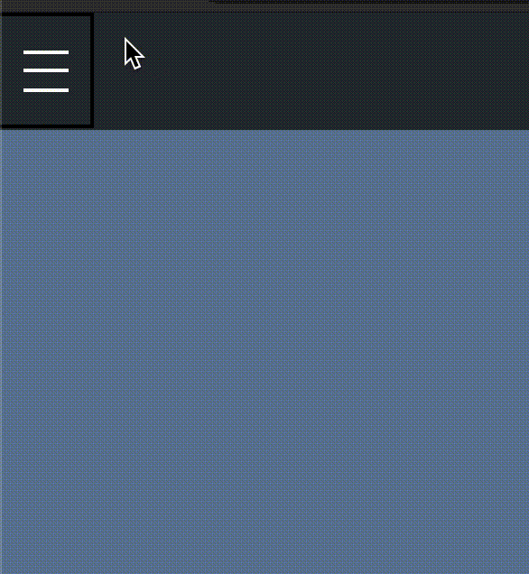

# Hamburger to Arrow animation in React js

Menu icon looks great when it transitions from hamburger to back-arrow icon. There are other packages, but this one gives you a full control on the looks and speed of animation. It is made using pure css animations hence performant.


# Installation

```javascript
npm i hamburger-to-arrow
```

## Usage

The minimal code to accomplish the animation with this package-

```javascript
import HamburgerToArrow from 'hamburger-to-arrow';

function App() {
  const [state, setState] = useState({
    burgerOpen: false
  });
const toggleBurger=()=>{
  setState({burgerOpen:!state.burgerOpen})
}

return <HamburgerToArrow
  burgerOpen={state.burgerOpen}
  onPress={toggleBurger}/>;
}
```

## Available Props

The component receives a total of 7 props-

| Prop | Accepted values | Default Value | Required | Description |
| ---- | --------------- | ------------- | -------- | ----------- |
| burgerOpen | true, false | false | yes | When true, the icon displayed is the hamburger icon and when false, the icon displayed is arrow-back icon. This value should be taken from state and passed as a prop. |
| onPress | function | {} | yes | a function that should be called on pressing the icon. This function should toggle the state variable- burgerOpen |
| tintColor | any color | white | no | Color of the icons |
| size | small, medium, large, xtra-large | large | no | size of the icons |
| thickness | number | 2 | no | thickness of the bars in the icons |
| speed | 1,2,3,4,5 | 3 | no | speed of animation, 1 for slowest |
|  id | number/string | | no | In case you use more than one <HamburgerToArrow> component in the same file, you must give a unique id to each component |
  
Here's an example showing all props being used-

```javascript
<HamburgerToArrow
  burgerOpen={state.burgerOpen}
  onPress={toggleBurger}
  tintColor="yellow"
  speed={5}
  thickness={3}
  size="medium"
  id={1}
/>
```

## A sample use case-


